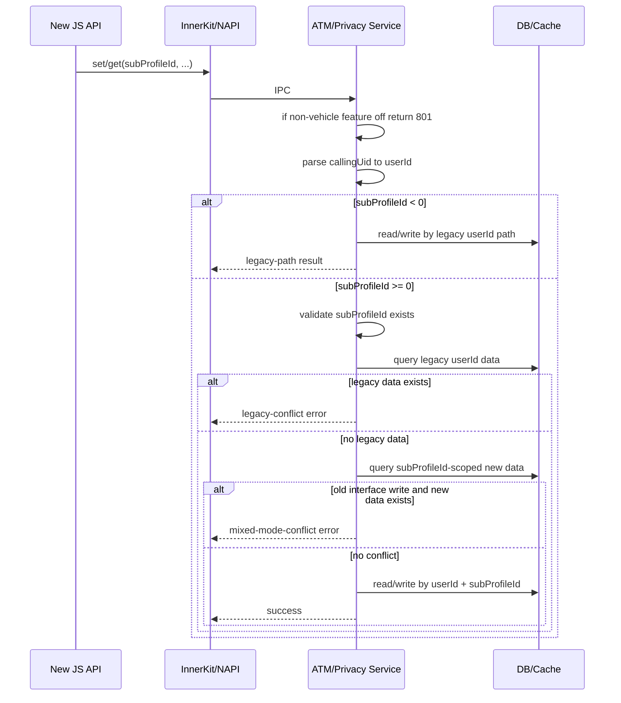

# 架构设计

## 设计元数据

| 字段 | 内容 |
|------|------|
| Design ID | DESIGN-permission-toggle-management-based-subprofileid |
| 关联需求 | `proposal.md` |
| 关联 Epic | 无 |
| 目标 Feature | 车机 `subProfileId` 开关隔离 |
| 复杂度 | 标准 |
| 目标版本 | `master` |
| Owner | TBD |
| 状态 | Draft |

## 需求基线

| 项 | 补充说明（如需） |
|----|------------------|
| 车机 feature 隔离 | 仅车机产品定义新 feature 时启用 `subProfileId` 逻辑；未定义时旧接口完整回退原行为，同名新增 `subProfileId` 签名返回 `801` |
| 兼容阻塞规则 | 旧 `userId` 老数据存在时，新路径对 `subProfileId` 的 `status=true/false` 都报错；一旦已存在 `subProfileId` 新数据，旧接口设置也报错 |
| `userId` 约束 | JS 新签名不暴露 `userId` 入参，服务端统一通过 `callingUid` 解析当前 `userId`；InnerKit 新路径保留 `userId` 参数，但仅允许传 `0`，非 `0` 直接返回 `201` |
| `subProfileId` 合法性 | `subProfileId>=0` 时必须校验当前 `userId` 下是否存在对应 profile，不存在返回新增错误码 |
| `subProfileId` 默认值 | InnerKit/内部新路径新增 `subProfileId` 入参默认值为 `-1`，所有 `<0` 均按旧路径存取处理 |

## 上下文和现状

### 涉及仓和模块

| 仓库 | 补充架构说明 |
|------|-------------|
| `security_access_token` | 本次仅修改当前仓，变更链路覆盖 JS/ETS API、InnerKit、IPC、服务层和持久化/缓存读取逻辑 |

### 调用链层级分析

| 层 | 模块 | 职责 | 修改类型 |
|----|------|------|----------|
| JS/ETS API | `frameworks/js/napi/*`, `frameworks/ets/ani/*` | 暴露旧 API 和新增 `subProfileId` API，做参数透传 | 修改 |
| InnerKit | `interfaces/innerkits/accesstoken`, `interfaces/innerkits/privacy` | 提供系统侧调用入口，保留 `userId` 参数并扩展 `subProfileId` 入参和错误码透出；`userId` 仅允许传 `0` | 修改 |
| IPC | `services/*/idl`, proxy/stub | 承载 `userId/subProfileId/status` 传递与错误码返回 | 修改 |
| 服务层 | `services/accesstokenmanager`, `services/privacymanager` | 解析 `callingUid`、执行 feature 分流、在未定义 feature 时统一将 `subProfileId` 归一化为 `-1`、校验旧数据/`subProfileId`、调用存储层 | 修改 |
| 存储/缓存 | 开关记录管理器、权限使用记录管理器 | 读取旧 `userId` 数据、判断阻塞、新旧路径清理与写入 | 修改 |

**检查项：**
- [x] 调用链每一层都已覆盖（从最上层到最底层）
- [x] 每层职责边界清晰，无跨层违规调用
- [x] 每层修改类型明确

### 适用架构规则

| Rule ID | 适用原因 | 设计结论 | 验证方式 |
|---------|----------|----------|----------|
| OH-ARCH-LAYERING | 涉及 JS/InnerKit/Service/存储分层 | 仍沿现有分层实现，校验逻辑放在服务层，JS 仅做 API 契约承载 | 代码评审 |
| OH-ARCH-IPC-SAF | 涉及 ATM/Privacy IPC 调整 | 复用现有 SA/IPC 链路，不新增跨层捷径 | 集成测试 |
| OH-ARCH-API-LEVEL | 涉及 System API 扩展 | 仅新增 System API，旧 API 保持兼容 | API 审查 |
| OH-ARCH-COMPONENT-BUILD | 涉及车机 feature 隔离 | 通过 feature 宏/开关控制车机启用，非车机不定义 feature | 构建验证 |
| OH-ARCH-ERROR-LOG | 涉及 `201`、`801` 和新增错误码 | 复用现有错误码体系；ATM 使用 `ERR_PERMISSION_REQUEST_TOGGLE_SUBPROFILE_NOT_EXIST`，Privacy 使用 `ERR_PERMISSION_USED_RECORD_SUBPROFILE_NOT_EXIST`，并在服务侧统一返回 | 单测 |

## 不涉及项承接

| 维度 | 设计结论 |
|------|----------|
| 性能 | 不引入新的重型持久化扫描；仅在新路径增加有限校验与旧数据判断 |
| 安全与权限 | `subProfileId` 写入前必须校验归属，防止跨 profile 串写 |
| 兼容性 | 旧 API 查询行为保留；`subProfileId<0` 时直接按旧路径存取；老数据阻塞新路径写入，且新数据存在时旧接口写入也被阻塞，避免新旧语义并存 |
| API/SDK | JS/ETS 在保持原函数名不变的前提下新增带 `subProfileId` 入参的新签名，InnerKit 保留 `userId` 语义并新增 `subProfileId` 入参 |
| IPC/跨进程 | 在现有请求中显式传递 `userId/subProfileId` 校验上下文 |
| 构建与部件 | feature 仅在车机定义；非车机旧接口保持原行为，同名新增 `subProfileId` 签名统一返回 `801` |
| 数据迁移 | 无自动迁移；通过旧路径清理后才切换到新路径 |
| 错误码 | 复用 `201` 拦截非法 `userId`；ATM 使用 `ERR_PERMISSION_REQUEST_TOGGLE_SUBPROFILE_NOT_EXIST`，Privacy 使用 `ERR_PERMISSION_USED_RECORD_SUBPROFILE_NOT_EXIST` |

## 关键设计决策

| 决策 ID | 问题 | 推荐方案 | 探索过的替代方案 | 取舍理由 | 影响 |
|---------|------|----------|-----------------|------|------|
| ADR-1 | 新旧维度如何共存 | 老数据存在时，新 `subProfileId` 路径只读继承、禁止写入；新数据存在时，旧接口写入也禁止 | 自动迁移到每个 `subProfileId`；新路径直接覆盖旧数据；允许旧新路径双写 | 双向阻塞最保守，可避免新旧语义并存和相互覆盖 | 服务层和测试需补齐双向错误码分支 |
| ADR-2 | 新路径如何识别目标用户 | JS 新签名和 InnerKit 新路径都由服务端解析 `callingUid`；InnerKit 仅保留 `userId` 参数占位且要求传 `0` | 所有新路径都不传 `userId`；所有新路径都要求显式传真实 `userId` | 统一由服务端解析更安全，同时维持 InnerKit 参数兼容 | 需要服务层统一梳理两类入口 |
| ADR-3 | `subProfileId` 合法性如何校验 | 在服务层对当前 userId 下的 `subProfileId` 做存在性校验 | 仅依赖下游存储层自然失败；在 JS 层预校验 | 服务层校验最集中，错误码可统一，且不依赖前端可信输入 | 需要引入/复用 profile 关系查询能力 |
| ADR-4 | 非车机平台如何保持兼容 | 通过 feature 隔离，未定义 feature 时旧接口完整走旧链路，服务端统一将任意传入的 `subProfileId` 归一化为 `-1`，同名新增 `subProfileId` 签名返回 `801` | 所有平台统一编译新逻辑后运行时判断；非车机也放开新签名 | 显式返回 `801` 更符合需求，也避免非车机误入新语义 | 需要评估返回 `801` 的实现位置 |

## 设计骨架

### 骨架范围

| 骨架项 | 目标 | 不包含 | 验证方式 |
|--------|------|--------|----------|
| API/接口骨架 | 为 JS/ETS 原函数新增 `subProfileId` 入参签名，并为 InnerKit 增加 `subProfileId=-1` 默认入参及旧路径分流 | 完整业务逻辑 | 编译/API 检查 |
| 模块骨架 | 在 ATM/Privacy 服务增加前置校验和 feature 分流入口 | 具体数据库操作细节 | 构建通过 |
| 测试骨架 | 新增 `userId=0`、`userId!=0`、`subProfileId` 不存在、老数据阻塞等测试入口 | 全场景数据准备 | 单测编译通过 |

### 骨架 Spec 拆分

| Task ID | 目标 | 受影响文件 | AC |
|---------|------|------------|-----|
| TASK-SKELETON-1 | 建立 JS/ETS 新 API 和 InnerKit 参数说明骨架 | JS/ETS、InnerKit 头文件与声明 | WHEN 新 API 编译通过 THEN 可承载 `subProfileId` 参数 |
| TASK-SKELETON-2 | 建立服务层前置校验骨架 | ATM/Privacy service, manager | WHEN 调用新路径 THEN 可命中 feature/`userId`/`subProfileId`/老数据校验分支 |

## 后续 Task 拆分

| Task ID | 目标 | 受影响文件 | 依赖 |
|---------|------|------------|------|
| TASK-1 | 实现 NAPI/ANI 同名新签名扩展和旧 API 兼容透传 | `frameworks/js/napi/*`, `frameworks/ets/ani/*` | design.md + spec.md Approved |
| TASK-2 | 实现 client / service 框架层参数传递、`callingUid` 解析、InnerKit `userId==0` 规则和 `subProfileId` 校验框架 | `interfaces/innerkits/*`, `services/*/idl`, proxy/stub, service入口 | TASK-1 |
| TASK-3 | 实现 ATM 开关存储逻辑和数据库/缓存兼容处理 | `services/accesstokenmanager` 及其存储管理器 | TASK-2 |
| TASK-4 | 实现 Privacy 开关存储逻辑和数据库/缓存兼容处理 | `services/privacymanager` 及其记录管理器 | TASK-2 |
| TASK-5 | 补充单测和回归测试 | `test/unittest`, `coverage` | TASK-3 + TASK-4 |

## API 签名、Kit 与权限

### 新增 API

| API 签名 | 类型 | Kit | d.ts 位置 | 权限要求 | SysCap |
|----------|------|-----|-----------|----------|--------|
| `setPermissionRequestToggleStatus(subProfileId, permissionName, status)` | System | abilityAccessCtrl | `@ohos.abilityAccessCtrl` | 沿用现有开关写权限 | 待与现有 API 对齐 |
| `getPermissionRequestToggleStatus(subProfileId, permissionName)` | System | abilityAccessCtrl | `@ohos.abilityAccessCtrl` | 沿用现有开关读权限 | 待与现有 API 对齐 |
| `setPermissionUsedRecordToggleStatus(subProfileId, status)` | System | privacyManager | `@ohos.privacyManager` | 沿用现有开关写权限 | 待与现有 API 对齐 |
| `getPermissionUsedRecordToggleStatus(subProfileId)` | System | privacyManager | `@ohos.privacyManager` | 沿用现有开关读权限 | 待与现有 API 对齐 |
| `GetTokenIDByUserID(userId, tokenIdList, subProfileId)` | InnerKit | accesstoken | `AccessTokenKit` | 沿用现有系统侧调用权限 | 仅 `AccessTokenKit` 保留 `subProfileId=-1` 默认值，client/service/IDL 显式透传 |

### 变更/废弃 API

| 原有 API | 变更类型 | 新 API | 迁移说明 |
|----------|----------|--------|----------|
| `AccessTokenKit::Set/GetPermissionRequestToggleStatus(..., userId, subProfileId = -1)` | 变更 | 原 `userId` 参数保留，新增 `subProfileId` 入参 | 旧内部调用方若继续使用新路径需改为传 `userId=0`；新调用方可显式传 `subProfileId` |
| `PrivacyKit::Set/GetPermissionUsedRecordToggleStatus(userId, ..., subProfileId = -1)` | 变更 | 原 `userId` 参数保留，新增 `subProfileId` 入参 | 旧内部调用方若继续使用新路径需改为传 `userId=0`；新调用方可显式传 `subProfileId` |
| 旧 JS API 同名旧签名 | 保留 | 同名新增带 `subProfileId` 入参的新签名 | 旧签名继续原行为，不迁移 |

## 构建系统影响

### BUILD.gn 变更

```
文件路径: 待实现阶段确定
变更说明: 可能增加车机 feature 宏定义透传，评估 JS/ETS 与服务层条件编译
```

### bundle.json 变更

当前预期无需新增 component；若 feature 定义依赖产品配置，仅在对应产品配置中声明。

## 数据流/控制流

| 步骤 | 调用方 | 被调用方 | 数据/接口 | 说明 |
|------|--------|----------|-----------|------|
| 1 | JS/ETS 新 API 或系统调用方 | InnerKit / NAPI | `subProfileId + 其余原有入参` | JS 新路径不暴露 `userId`，且 `subProfileId` 为第一个入参 |
| 2 | InnerKit / NAPI | Service Proxy | IPC 请求 | 不做业务判断，只透传 |
| 3 | Service | feature/调用上下文 | feature 开关, `callingUid -> userId` | 非车机同名新增 `subProfileId` 签名先返回 `801`；车机 JS 新签名再解析 `callingUid`；InnerKit 新路径校验 `userId==0` 后解析；未定义 feature 时服务端统一将 `subProfileId` 归一化为 `-1` |
| 4 | Service | 路径分流 | `subProfileId` | `subProfileId<0` 时直接按旧路径存取 |
| 5 | Service | profile 关系查询能力 | `userId + subProfileId` | 仅 `subProfileId>=0` 时校验 profile 是否存在 |
| 6 | Service | 旧数据存储/缓存 | `userId` | 判断是否存在旧数据，存在则新路径写入报错 |
| 7 | Service | 新维度存储/缓存 | `userId + subProfileId` | 判断是否已存在新数据；存在时旧接口写入报错 |
| 8 | Service | 新维度存储/缓存 | `userId + subProfileId` | 仅在通过双向阻塞校验后读写 |

## 时序设计



## 数据模型设计

**存储方案：**

| 数据类型 | 存储方式 | 位置 | 生命周期 |
|----------|----------|------|----------|
| 旧开关数据 | 现有 DB/缓存键，按 `userId` | 现有 ATM/Privacy 存储 | 持久化 |
| 新开关数据 | 扩展为 `userId + subProfileId (+ permissionName)` 维度 | 现有 DB/缓存结构扩展 | 持久化 |

### 数据库兼容设计

| 项 | 设计结论 |
|----|----------|
| 兼容策略 | 采用“同表扩列 + 读路径分流”，不做上线时自动迁移，不批量回填旧数据 |
| 新增列 | 在 ATM/Privacy 对应开关表中新增 `sub_profile_id` 列，默认值为 `-1` |
| 升级默认值 | 数据库升级加列时，历史记录的 `sub_profile_id` 统一按 `-1` 处理，语义等同旧路径数据 |
| 旧数据标识 | 历史 `userId` 维度记录统一视为 `sub_profile_id = -1` 的旧路径数据 |
| 新数据标识 | 新路径写入时使用 `sub_profile_id >= 0`，与 `userId` 共同标识一条 `subProfileId` 维度记录 |
| 旧路径读写 | 当接口走旧路径，或 `subProfileId < 0` 时，仅访问 `sub_profile_id = -1` 的记录 |
| 新路径读写 | 当 `subProfileId >= 0` 且通过合法性校验后，仅访问 `userId + sub_profile_id (+ permissionName)` 对应记录 |
| 老数据阻塞 | 若某 `userId` 下仍存在 `sub_profile_id = -1` 的旧记录，则禁止对该 `userId` 走 `subProfileId >= 0` 的写入，返回 storage mode conflict |
| 新数据阻塞 | 若某 `userId` 下已存在任意 `sub_profile_id >= 0` 的新记录，则禁止再走旧路径写入，返回 storage mode conflict |
| 清理切换 | 旧路径执行清理时，删除该 `userId` 下 `sub_profile_id = -1` 的 DB 记录并同步清理缓存；清理完成后才允许写入 `sub_profile_id >= 0` 的新记录 |
| 查询继承 | 新路径查询时，如果 `userId` 下仅有 `sub_profile_id = -1` 旧记录，则查询结果继承旧记录值；不生成物理复制行 |
| 唯一性约束 | ATM 建议按 `userId + permissionName + sub_profile_id` 建立唯一约束；Privacy 建议按 `userId + sub_profile_id` 建立唯一约束 |
| 缓存一致性 | 缓存键同步扩展 `subProfileId` 维度；旧路径缓存统一以 `subProfileId = -1` 视角管理 |
| 升级回滚 | 因为不做自动迁移，版本升级仅新增列和兼容读逻辑；升级后历史数据按 `sub_profile_id = -1` 理解；回滚时旧 `sub_profile_id = -1` 数据仍可被旧逻辑理解 |

## 接口参数规约

| 接口 | 参数 | 类型 | 合法范围 | 非法处理 | 边界说明 |
|------|------|------|----------|----------|----------|
| JS/ETS 同名新签名 | `subProfileId` | int32 | `>=0` 且归属 `callingUid` 解析出的当前 `userId` | 非车机返回 `801`；ATM 返回 `ERR_PERMISSION_REQUEST_TOGGLE_SUBPROFILE_NOT_EXIST`，Privacy 返回 `ERR_PERMISSION_USED_RECORD_SUBPROFILE_NOT_EXIST` | 第一个入参，且仅车机 feature 开启时生效 |
| JS/ETS 同名新签名 | `status` | bool/enum | 沿用现有合法值 | 旧数据存在时返回兼容错误码 | `true/false` 都受老数据阻塞 |
| InnerKit/内部新路径 | `userId` | int32 | 固定为 `0` | 非 `0` 返回 `201` | 服务端据此通过 `callingUid` 解析当前 `userId` |
| InnerKit/内部新路径 | `subProfileId` | int32 | 默认 `-1`；任何 `<0` 均按旧路径存取；`>=0` 时需归属当前 `userId` | ATM 返回 `ERR_PERMISSION_REQUEST_TOGGLE_SUBPROFILE_NOT_EXIST`，Privacy 返回 `ERR_PERMISSION_USED_RECORD_SUBPROFILE_NOT_EXIST` | `userId` 解析完成后再做 profile 校验 |
| 旧 JS/旧系统接口 | `status` | bool/enum | 沿用现有合法值 | 已存在 `subProfileId` 新数据时返回兼容错误码 | 防止旧路径覆盖新维度数据 |

## 线程与并发模型

| 操作 | 发起线程 | 回调线程 | 跨进程边界 | 线程安全 | 重入约束 |
|------|----------|----------|------------|----------|----------|
| 新路径 set/get | JS/NAPI/Binder | Binder/调用线程 | 是 | 复用现有管理器锁/缓存同步机制 | 同一 `userId` 清理与写入需串行化 |

**并发场景：**

| 场景 | 竞争对象 | 保护机制 | 预期行为 |
|------|----------|----------|----------|
| 旧路径清理与新路径写入并发 | 同一 `userId` 的 DB/缓存记录 | 复用现有锁或新增 user 级串行化 | 未完成清理前，新路径持续返回兼容错误 |
| 新路径写入后旧接口再次写入 | 同一 `userId` 下旧键与新键 | 复用现有锁并增加模式冲突检查 | 旧接口返回兼容错误，不覆盖新数据 |

## 风险和开放问题

| 项 | 类型 | 影响 | 处理方式 | Owner |
|----|------|------|----------|-------|
| `subProfileId` 存在性查询能力来自何处 | 外部依赖 | 若缺少现成接口，实现会被阻塞 | TODO: 接入账号能力（如 `OsAccountManager::QueryOsAccountById`）后完成 `subProfileId >= 0` 存在性校验 | TBD |
| 兼容错误码与新增错误码枚举值 | 设计 | 影响 API 契约和测试 | ATM 使用 `ERR_PERMISSION_REQUEST_TOGGLE_STORAGE_MODE_CONFLICT` / `ERR_PERMISSION_REQUEST_TOGGLE_SUBPROFILE_NOT_EXIST`；Privacy 使用 `ERR_PERMISSION_USED_RECORD_STORAGE_MODE_CONFLICT` / `ERR_PERMISSION_USED_RECORD_SUBPROFILE_NOT_EXIST`；Stage 3 与现有错误码体系对齐数值 | TBD |
